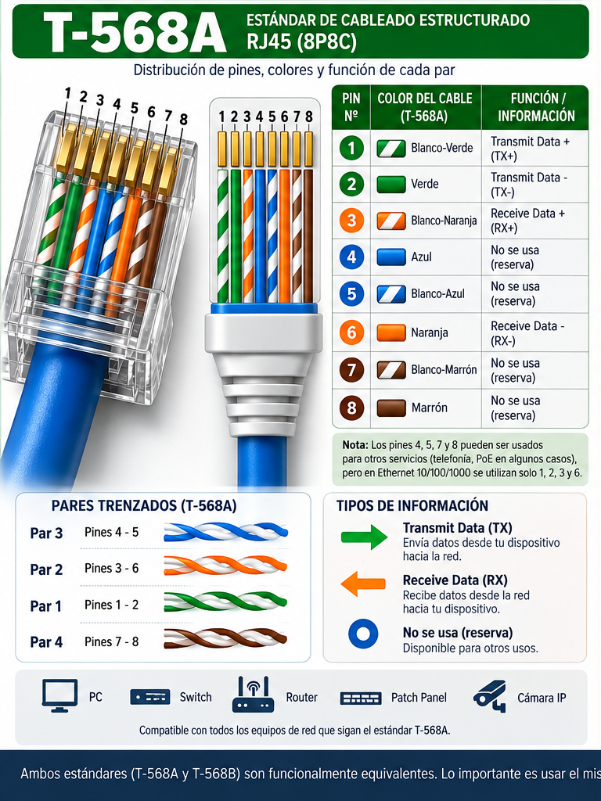
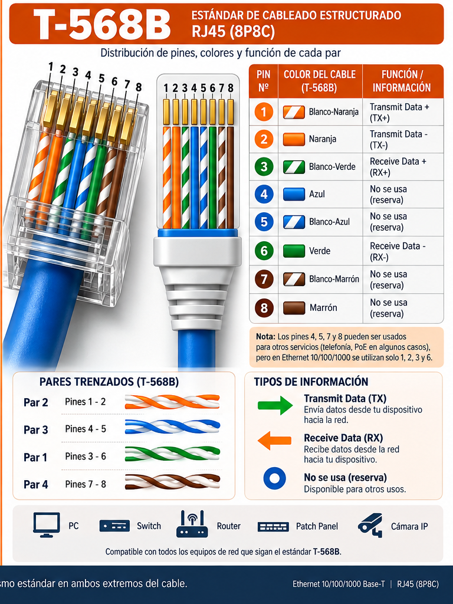

# T-568A y T-568B — RJ45 Ethernet Pinout

Infografías técnicas de referencia para estudiar y documentar el cableado Ethernet **RJ45 (8P8C)** según los estándares **T-568A** y **T-568B**.

## 📁 Contenido

| Archivo | Descripción |
|---|---|
| `T568A_RJ45_Pinout_Infographic.png` | Pinout, colores, pares trenzados y función de los pines según T-568A |
| `T568B_RJ45_Pinout_Infographic.png` | Pinout, colores, pares trenzados y función de los pines según T-568B |

## 🔌 T-568A

Orden de los conductores:

1. Blanco-Verde
2. Verde
3. Blanco-Naranja
4. Azul
5. Blanco-Azul
6. Naranja
7. Blanco-Marrón
8. Marrón

## 🔌 T-568B

Orden de los conductores:

1. Blanco-Naranja
2. Naranja
3. Blanco-Verde
4. Azul
5. Blanco-Azul
6. Verde
7. Blanco-Marrón
8. Marrón

## 🌐 ¿Qué información viaja por cada par?

En Ethernet tradicional de **10/100 Mbps**, los pares utilizados para datos son:

- **Pines 1–2:** par de transmisión (TX)
- **Pines 3–6:** par de recepción (RX)
- **Pines 4–5:** par adicional
- **Pines 7–8:** par adicional

> **Importante:** la asignación TX/RX mostrada depende del tipo de equipo y del modo de Ethernet. En redes modernas con **Auto-MDI/MDIX**, los dispositivos pueden detectar automáticamente la configuración necesaria.

Para **Gigabit Ethernet (1000BASE-T)** se utilizan los **cuatro pares** para transmitir y recibir datos simultáneamente mediante señalización diferencial.

## 🧠 T-568A vs T-568B

La diferencia principal entre ambos estándares es el intercambio de los pares **verde** y **naranja**.

| Pin | T-568A | T-568B |
|---:|---|---|
| 1 | Blanco-Verde | Blanco-Naranja |
| 2 | Verde | Naranja |
| 3 | Blanco-Naranja | Blanco-Verde |
| 4 | Azul | Azul |
| 5 | Blanco-Azul | Blanco-Azul |
| 6 | Naranja | Verde |
| 7 | Blanco-Marrón | Blanco-Marrón |
| 8 | Marrón | Marrón |

## 🛠️ Cable directo y cable cruzado

- **Cable directo (straight-through):** mismo estándar en ambos extremos, por ejemplo **T-568B ↔ T-568B**.
- **Cable cruzado (crossover):** un extremo T-568A y el otro T-568B.
- En equipos actuales, **Auto-MDI/MDIX** hace que los cables cruzados sean mucho menos necesarios.

## 📚 Objetivo de este material

Este material está pensado como apoyo visual para:

- Estudiar **CCNA y fundamentos de redes**.
- Aprender el orden de los pines RJ45.
- Comprender la relación entre **pines, pares trenzados y señales**.
- Practicar la fabricación y comprobación de cables Ethernet.
- Documentar laboratorios de redes y Packet Tracer.

## ⚠️ Nota técnica

Estas imágenes son una **guía educativa**. La función exacta de los pares depende de la velocidad Ethernet y de la tecnología utilizada. Para instalaciones profesionales, debe consultarse la documentación y normativa aplicable.

---

**Tema:** Ethernet · RJ45 · 8P8C · T-568A · T-568B · Networking · CCNA

# 🖼️ Infografías

A continuación se muestran las dos infografías completas utilizadas como referencia visual.

## T-568A — RJ45 Pinout

## T-568B — RJ45 Pinout

